<!--
  This repository is named after the account on purpose: GitHub renders this
  one README on the profile page at github.com/KrisEllaDavid.

  Two images carry it, and neither depends on a third-party service.

  The banner is composed by Cloudinary out of his own two photographs — the
  hero frame's chevron field behind, the portrait face-detected and cut to a
  circle in front — from the same account the portfolio serves its media
  from. `domains.svg` is hand-authored and lives in this repository, so it
  cannot rate-limit or go down. An earlier version of this page used
  github-readme-stats for two cards; both were rendering as broken-image alt
  text on the live profile, which is exactly the failure mode being avoided.

  Palette is the portfolio's own: #1a6ef5 is the mark's blue, #4d9aff the
  accent, #070b11 the page.
-->

  

  
  
  

  <strong>Digital Systems Engineer</strong>, I design and ship products end to end: 
  the interface, the API behind it, and the cloud that runs them. 
  Based in Yaoundé, Cameroon.

  

### What I build with

  
  
  
  
  
  
  
  
  
  
  

### Selected work

| Project | What it is | |
|---|---|---|
| **E-Testing Suite** | Institutional online examination platform, built into a university's digital infrastructure. | [Live](https://e-testingsuite.com) |
| **Libroware** | Book management system — React, Apollo GraphQL, Express on Node.js. | [Repo](https://github.com/KrisEllaDavid/libroware) |
| **Autofish Store** | Mobile marketplace for agro-producers in Cameroon and Congo. | [Repo](https://github.com/KrisEllaDavid/autofish_mobile) |
| **INTIA Assurance** | Client and insurance-contract management platform — MVC, GraphQL, React, Docker. | [Repo](https://github.com/KrisEllaDavid/intia-assurance) |
| **LAMEUTE Radio** | Web radio built on Node.js, Express and React. | [Repo](https://github.com/KrisEllaDavid/LameuteRadio) |
| **AutoSim** | Finite automata simulator in JavaFX. | [Repo](https://github.com/KrisEllaDavid/AutoSim) |

Every one of them, with the story behind it — the problem, the constraints,
what I decided and why — is at **[krisella.lameute.cm](https://krisella.lameute.cm)**.

  <a href="https://krisella.lameute.cm">krisella.lameute.cm</a> · Yaoundé, Cameroon

